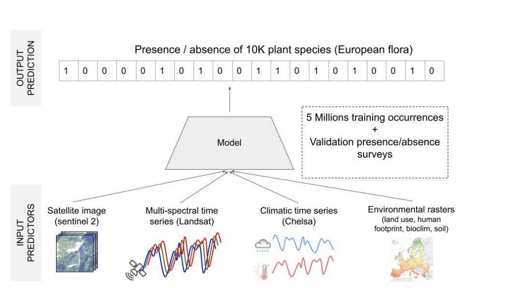
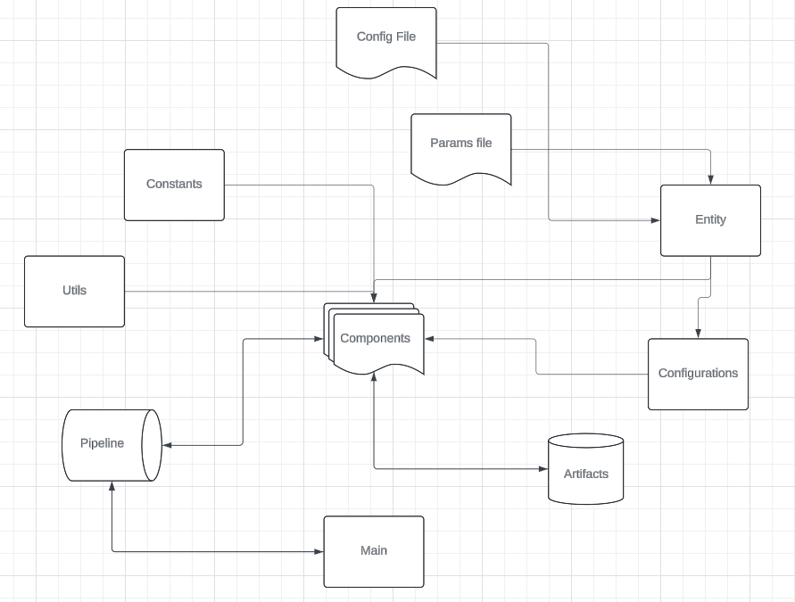

# Species Composition Prediction with High Spatial Resolution at Continental Scale Using Remote Sensing

## Overview

The **Species Composition Prediction** project aims to predict plant species in a given location and time using various predictors such as satellite images, climatic time series, and other rasterized environmental data. This project leverages a large-scale training set of plant occurrences in Europe to develop and validate predictive models.

## Project Goals

1. **Predict Plant Species**: Utilize satellite images, climatic time series, land cover, human footprint, bioclimatic, and soil variables to predict plant species at specific locations and times.
2. **Large-Scale Training and Validation**: Provide a substantial training set with millions of plant occurrences and detailed validation and test sets to ensure robust model performance.
3. **Tackle Challenges**: Address multi-label learning from single positive labels, strong class imbalance, multi-modal learning, and large-scale data processing.

Aim to develop and evaluate models that predict plant species
composition at high spatial resolution (∼10m) from diverse type of input environmental predictors,
by calibrating them on two types of species observations: Opportunistic presence-only records and
standardized presence-absence surveys

image courtesy : Christophe Botella, Benjamin Deneu, Diego Marcos, Maximilien Servajean, Joaquim Estopinan, et al.. The GeoLifeCLEF 2023 Dataset to evaluate plant species distribution models at high spatial resolution across Europe. 2023. ⟨hal-04152362⟩
## Dataset

### Training Set
- **Size**: Approximately 5 million plant occurrences
- **Type**: Single-label, presence-only data
- **Region**: Europe

### Validation Set
- **Size**: About 5,000 plots
- **Type**: Multi-label, presence-absence data

### Test Set
- **Size**: 20,000 plots
- **Type**: Multi-label, presence-absence data

## Predictors

The prediction models will use the following types of data:

1. **Satellite Images and Time Series**
2. **Climatic Time Series**
3. **Land Cover Data**
4. **Human Footprint Data**
5. **Bioclimatic Variables**
6. **Soil Variables**

## Challenges

1. **Multi-Label Learning from Single Positive Labels**: Handling the complexity of predicting multiple species from data that often contains only a single positive instance.
2. **Strong Class Imbalance**: Managing the disproportionate representation of different species in the dataset.
3. **Multi-Modal Learning**: Integrating diverse types of data (e.g., satellite images and climatic series) effectively.
4. **Large-Scale Data Processing**: Efficiently processing and analyzing a vast amount of data to generate accurate predictions.

## Workflows

## Usage

### Installation

To get started with the project, clone the repository and install the required dependencies using requirements.txt

### Author
Collaborations and contributions are open for this project.
 
Contact :[ yashraj3376@gmail.com]
