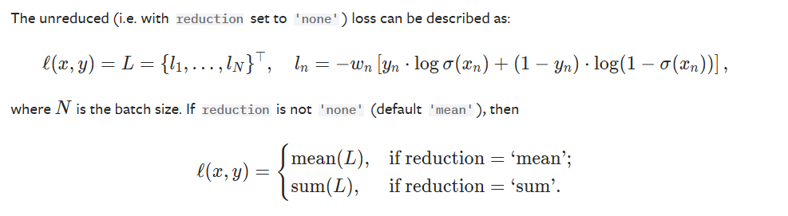
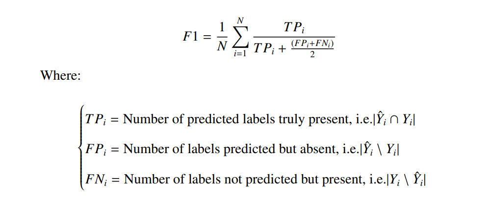

# Baseline Experiments and Evaluation

## Overview

This section provides a detailed overview of the baseline experiments conducted to evaluate the performance of different models and data modalities. The goal was to establish a comparative framework to understand how each modality contributes to the predictive accuracy of species distribution modeling.

## Table of Contents

1. [Introduction](#introduction)
2. [Experimental Setup](#experimental-setup)
3. [Baseline Models](#baseline-models)
4. [Evaluation Metrics](#evaluation-metrics)
5. [Results](#results)
6. [Discussion](#discussion)
7. [Conclusion](#conclusion)

## Introduction

To establish a solid foundation for our multimodal model, we conducted a series of baseline experiments. These experiments aimed to:
- Evaluate the performance of individual data modalities.
- Compare different neural network architectures.
- Understand the impact of various preprocessing and augmentation techniques.

## Experimental Setup

### Data Preparation

The datasets used in the experiments include:
- **Satellite Image Patches**: RGB and NIR patches from Sentinel-2.
- **Satellite Time Series**: Seasonal median values from Landsat.
- **Monthly Climatic Rasters**: Climatic variables from Chelsa.
- **Environmental Rasters**: Various environmental features like bioclimatic, soil, elevation, land cover, and human footprint.

### Preprocessing

1. **Normalization**: Applied to all numerical features.
2. **Resizing**: Image patches resized to 128x128 pixels.
3. **Missing Value Handling**: Imputed using median values for continuous variables.

### Experimental Design

Experiments were conducted using different combinations of data modalities:
- **Experiment 1**: Baseline with Bioclimatic Cubes.
- **Experiment 2**: Baseline with Landsat Cubes (Landsat).
- **Experiment 3**: Baseline with Sentinel Images.
- **Experiment 4**: Multimodal model integrating all data sources (including Environmental Rasters.)

## Baseline Models

### Model Architectures

1. **ResNet18**: Used for processing Satellite Image Patches and Bioclimatic Cubes.
2. **Swin Transformer (Swin-v2-t)**: Applied to Sentinel Image Patches.
3. **Feed-Forward Neural Network (FFNN)**: Used for tabular data (Environmental Rasters).
4. **Siamese Network**: Integrated model with distinct backbones for each data modality.

### Training Configuration

- **Optimizer**: AdamW
- **Learning Rate**: 3e-4
- **Loss Function**: Binary Cross Entropy (BCE)
- **Epochs**: 15 for full training (3 for debugging)
- **Batch Size**: 32

#### Loss Function : Sigmoid and BCELoss Combined.

This loss function combines a Sigmoid layer and the BCELoss into a single class. This version is more numerically stable than using a plain Sigmoid followed by a BCELoss because, by combining the operations into one layer, it takes advantage of the log-sum-exp trick for numerical stability.

This is used for measuring the error of a reconstruction in for example an auto-encoder. Note that the targets t[i] should be numbers between 0 and 1.
## Evaluation Metrics

To evaluate the model performance, the metrics used was:

- **F1-Score**: Harmonic mean of precision and recall.

## Results

### Experiment 1: Baseline with Bioclimatic Cubes.
**Score** : 0.25784

### Experiment 2: Baseline with Landsat Cubes.
**Score** : 0.26424

### Experiment 3: Baseline with Sentinel Images.
**Score** : 0.23555

### Experiment 4: Multimodal Model.
**Score** : 0.31626 

Which is the increment from all individual experiments. 

## Discussion

The results indicate that the multimodal model significantly outperforms individual modality models. Key observations include:
- Satellite Time Series data provided better accuracy compared to other single modalities.
- The integration of multiple data sources in the multimodal model captures the complexity of environmental factors influencing species distribution, leading to improved performance.
- Advanced architectures like the Swin Transformer and the Siamese Network contributed to higher accuracy and robustness in predictions.

## Conclusion

The baseline experiments highlight the importance of integrating diverse data modalities for species distribution modeling. The multimodal approach not only improves predictive accuracy but also provides a comprehensive understanding of the factors influencing species presence. Future work will focus on refining these models, incorporating additional data sources, and enhancing scalability and real-time capabilities.

## Future Work

Based on these baseline experiments, future directions include:
- Experimenting with more advanced deep learning architectures.
- Incorporating attention mechanisms to focus on relevant features.
- Enhancing data preprocessing and augmentation techniques.
- Exploring the use of higher resolution and additional environmental data sources.

---

By establishing these baselines, we have a solid foundation for further improving and validating our species distribution models.
